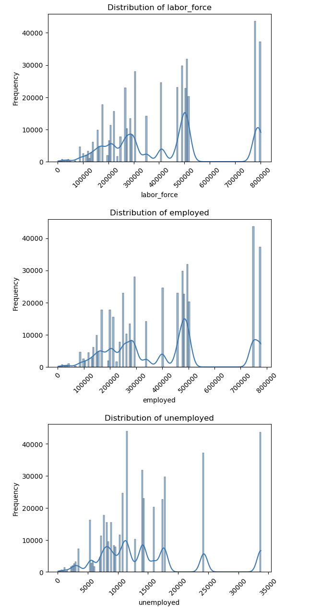
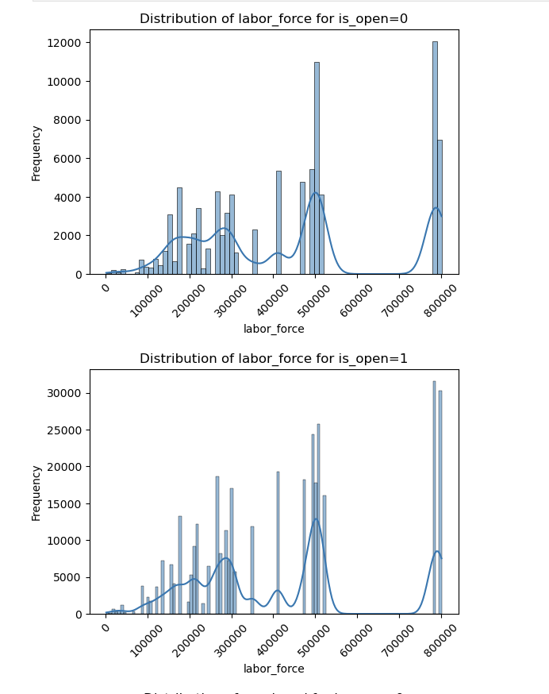
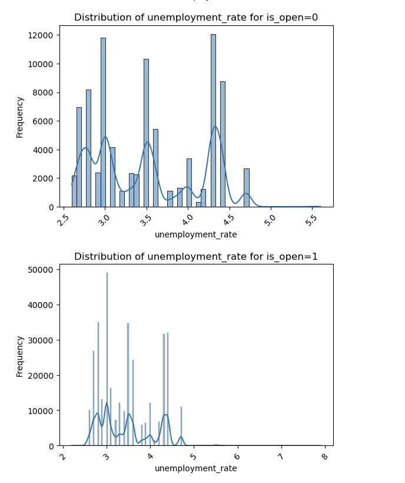
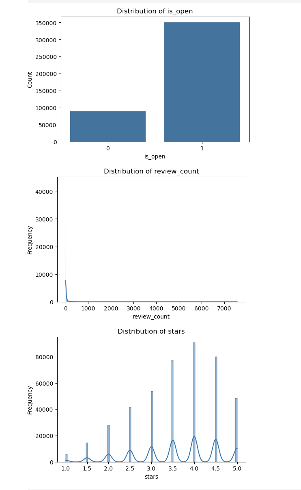
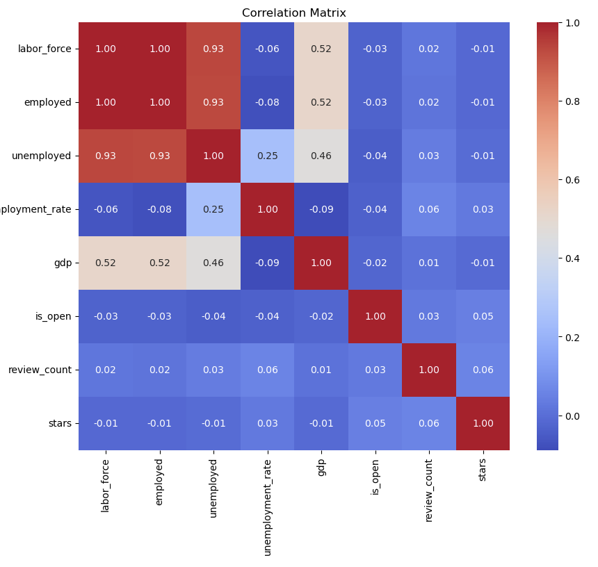
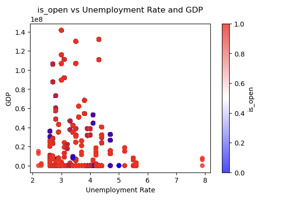
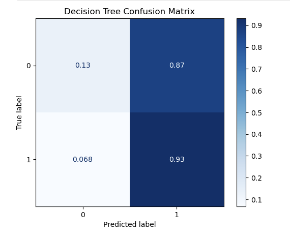
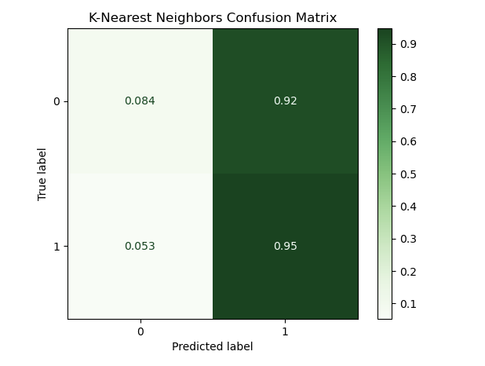

# Small Business Success Factors

## Overview

This project explores how local factors influence small business success using data from the Yelp Open Dataset. By analyzing business attributes, restaurant hours, ratings, and location data, we aim to identify key predictors of business performance and survival across different U.S. regions. 

## Final Report


## Team Members

- Khoa Cao (kcao@bu.edu)
- John Kim (jjk29@bu.edu)
- Laurel Purcell (lgp116@bu.edu)
- Patty Huang (pattyh@bu.edu)

## Objectives

- Analyze Yelp business data to understand what factors contribute to successful small businesses.

- Investigate how geography, customer sentiment, and business attributes relate to success.

- Build predictive models to estimate business outcomes such as:
    - Average rating
    - Review volume
    - Business closure likelihood

## Data Sources

The dataset includes millions of records across multiple tables from the Yelp dataset (https://business.yelp.com/data/resources/open-dataset/) such as:
- business.json – Business metadata (location, category, attributes, average rating)
- review.json – User reviews and star ratings
- user.json – User information and engagement metrics
- checkin.json – Customer check-in patterns
- tip.json – User tips and recommendations

We will also use the following supplemental data sources:
- Bureau of Labor Statistics (https://www.bls.gov/lau/tables.htm#cntyaa) - Per-county labor force and unemployment rate
- BEA (https://apps.bea.gov/regional/downloadzip.htm) - Per-county GDP and/or personal income
- County shapefiles from US Census (https://www2.census.gov/geo/tiger/GENZ2018/shp/cb_2018_us_county_5m.zip) - To map businesses to counties

## How to Build and Run the Code

1. Clone the repository

git clone https://github.com/koacow/predicting-small-business-performance
cd predicting-small-business-performance

2. Install dependencies 

pip install -r requirements.txt

Open code.ipynb in Jupyter Notebook or JupyterLab and run all cells to compile the dataset  (business_economic_data.csv)
Then open exploratory_data_analysis.ipynb and run all cells to perform exploratory analysis, train models, and generate visualizations.

## Directory Structure

```bash
predicting-small-business-performance/
    ├── data/
    │   ├── Yelp JSON/
    │   │   └── yelp_dataset/
    │   │       └── yelp_academic_dataset_business.json
    │   │       └── yelp_academic_dataset_review.json
    │   ├── bea/
    │   │   └── CAGDP1__ALL_AREAS_2001_2023.csv
    │   └── bls/
    │       └── laucnty23.xlsx
    │   └── cb_2018_us_county_5m/
    │       └── cb_2018_us_county_5m.shp
    │── compile_dataset.ipynb
    └── business_economic_data.csv
```

## Testing and GitHub Workflow

Running all cells in code.ipynb and exploratory_data_analysis.ipynb will:

In code.ipynb:
- The dataset is compiled from Yelp, BLS, BEA, and Census sources into business_economic_data.csv.
- Shape and column checks confirm successful compilation.
- Required columns include:
    - business_id
    - is_open
    - stars
    - review_count
    - labor_force
    - gdp

In exploratory_data_analysis.ipynb:
- Preprocessing steps (dropping missing values, normalizing features) are validated by running without errors.
- Classification reports for Decision Tree and KNN confirm models train successfully.
- Confusion matrices serve as validation of predictive performance.
- Visualizations (correlation heatmap, scatter plots, distributions) confirm data integrity and relationships.

## Visualizations

The notebooks generate a variety of plots to explore the data and evaluate models:
- Distributions of labor force, employed, unemployed, unemployment rate, GDP.
    - 
    - 
- Distribution of labor force by business status (`is_open = 0` vs `is_open = 1`)  
    - 
- Distribution of unemployment rate by business status (`is_open = 0` vs `is_open = 1`)  
    - 
- Distribution of Yelp star ratings, review counts, business status
    - 
- Correlation matrix showing relationships among covariates and targets
    - 
- Scatter plots of unemployment rate vs GDP, colored by business status
    - 
- Confusion matrix for Decision Tree 
    - 
- Confusion matrix for KNN
    - 


## Data Processing and Modeling

Data compilation:
- Yelp Business Dataset (business + reviews + tips), filtered to restaurants (~12,000 businesses). The dataset includes business metadata, hours, categories, attributes, review-level text, and tip-level text. After preprocessing and merging, the full integrated dataset used for modeling includes ~56,000 U.S. restaurants enriched with economic indicators.
- BLS LAUS (county-level labor force, employment, unemployment, unemployment rate). These measures provide insight into the labor market conditions surrounding each business.
- BEA CAGDP1 (county-level GDP). GDP by county captures broader economic activity and purchasing power within each region.
- Census county shapefiles (geospatial joins using latitude/longitude → FIPS codes). Geospatial merging ensures that each business is matched to its correct county-level economic indicators.

Data integration and cleaning:
- Yelp businesses were assigned to counties via a GeoPandas spatial join using latitude/longitude and county shapefiles. Each business received a 5-digit FIPS code for economic merging.
- BLS and BEA datasets were merged using left joins on FIPS, retaining all counties with labor market data. GDP was missing for ~1.5% of county–years; other labor metrics were complete.
- The merged dataset was inspected for structural consistency and missingness. Businesses outside the U.S. or lacking valid spatial matches were excluded.
- After standardizing variable names and removing unnecessary columns (business name, address, phone, etc.), the final analytical dataset contained ~56,000 U.S. businesses with complete county-level economic variables.

Feature engineering:
- Categories and Attributes: Parsed Yelp categories into counts of category labels and extracted attribute dictionaries into counts of business characteristics. These variables measure business complexity, offerings, and specialization.
- Operational Hours: Derived total weekly hours, number of days open, and average hours per day from the hours field. These features reflect operational intensity and customer accessibility.
- Review-based features: Computed average star rating, total review count, weighted average review length (weighted by useful votes), and concatenated review text. These features summarize customer engagement and sentiment tendencies.
- Tip-based features: Computed total number of tips, weighted average tip length (weighted by compliments), total compliments, and average compliments per tip. These extend the sentiment and engagement signals beyond formal reviews.
- Sentiment analysis: Applied VADER to average tip text to generate a sentiment score from –1 to +1, capturing customer tone.
- Text processing: Concatenated all reviews and tips for each business and vectorized the text using TF-IDF with 5,000 features, including unigrams and bigrams. Terms with fewer than 5 occurrences or appearing in more than 80% of documents were filtered out. This provides a high-dimensional representation of customer language.

Preprocessing:
- Combined TF-IDF features with numeric attributes to form a modeling matrix with more than 5,000 columns.
- Standardized all numeric features using z-score normalization to ensure comparability between economic variables, operational metrics, and text-derived counts.
- Dropped rows with missing critical covariates to maintain data consistency.
- Split into training/testing sets (80/20).

Modeling:
- Baseline models: Decision Tree Classifier (max depth = 10) and K-Nearest Neighbors (k = 10, Euclidean distance) were trained on the numeric + engineered feature subset (~10,500 businesses × 25 features).
- Advanced models: Bagging Classifier with Logistic Regression and XGBoost Classifier were trained on the full engineered dataset, including TF-IDF features (~56,000 businesses × 5,000+ features). These models were selected for their ability to handle high-dimensional sparse matrices and nonlinear patterns.
- XGBoost demonstrated strong predictive performance and interpretability through feature importance rankings.
- Evaluation included accuracy, precision/recall/F1, ROC-AUC (for XGBoost), and normalized confusion matrices.

Results

Decision Tree:
- Accuracy: ~77%
- Recall (open businesses): 0.93
- Recall (closed businesses): 0.13
- Precision (open): 0.80, Precision (closed): 0.40
- F1 (open): 0.86, F1 (closed): 0.19
- Confusion matrix shows strong performance on open businesses but frequent misclassification of closed businesses.

K-Nearest Neighbors:
- Accuracy: ~77%
- Recall (open businesses): 0.95
- Recall (closed businesses): 0.08
- Precision (open): 0.78, Precision (closed): 0.33
- F1 (open): 0.86, F1 (closed): 0.13
- Confusion matrix confirms bias toward predicting open businesses.

Bagging Classifier (Logistic Regression base):
- Accuracy: 76%
- F1 Score: 0.76
- Stable performance but limited ability to capture nonlinear relationships or subtle text signals.
- XGBoost Classifier:
- Accuracy: 78.5%
- F1 Score: 0.79
- ROC-AUC: 0.87, demonstrating strong separation between open and closed businesses.
- Improved recall for the minority class (closed businesses) relative to baseline models.

Feature importance analysis:
- Top predictors included TF-IDF terms related to customer experience, business quality, and external shocks (e.g., terms referencing COVID-related disruptions).
- Structured features such as number of attributes and number of categories contributed significantly, indicating that business variety and operational complexity relate to long-term survival.
- Review count, tip sentiment, and service-related text patterns were highly informative, reflecting the role of customer engagement and satisfaction.
- The presence of words like “closed” among top TF-IDF terms highlights a leakage issue and indicates the need for improved filtering in future work.

Key insights:
- All models predict open businesses well but show limited recall for closed businesses due to class imbalance (85% open vs 15% closed).
- Economic indicators (labor force, unemployment rate, GDP) add meaningful context but must be normalized to avoid dominance by large-scale variables.
- Review- and tip-level aggregations provide powerful predictive signals, demonstrating the value of combining unstructured text with structured data.
- Addressing class imbalance—via resampling, class-weighted loss functions, or synthetic minority generation—represents a key avenue for improving closed-business detection.
- Additional features such as review sentiment (full text), business age, or local income levels could enrich modeling performance.

Conclusion
Through comprehensive integration of Yelp business data with county-level economic indicators, combined with robust feature engineering and predictive modeling, this project demonstrates that small business outcomes are influenced jointly by customer sentiment, operational characteristics, and macroeconomic conditions. The fusion of structured numerical data with high-dimensional TF-IDF features enables both accurate prediction and rich interpretability. Future work should focus on mitigating class imbalance, incorporating full review sentiment analysis, and exploring temporal dynamics in business survival.


